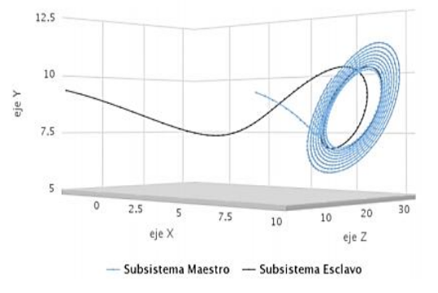

# encrypt-video

This algorithm uses chaos theory to encrypt a video captured by the camera.

## Instalation

Just install it using `pip`, this project is build using `python3`.

```bash
virtualenv env -p python3
source env/bin/activate
pip3 install -r requirements.txt
```

## Theory

Based on the study of presence of chaotic oscillations Pecora and Carrol originated the synchronization theory.
Basically, you can synchronize the attractors trajectories of a slave subsystem with a master subsystem sequence. 



Bear in mind this, you can take advantage of chaos to encrypt and decrypt any kind of data. We used two strategies:
`diffusion` and `permutation` to exchange and change the image pixels. You can find more information at this 
[doc](doc/PROYECTO_DE_GRADO.pdf).